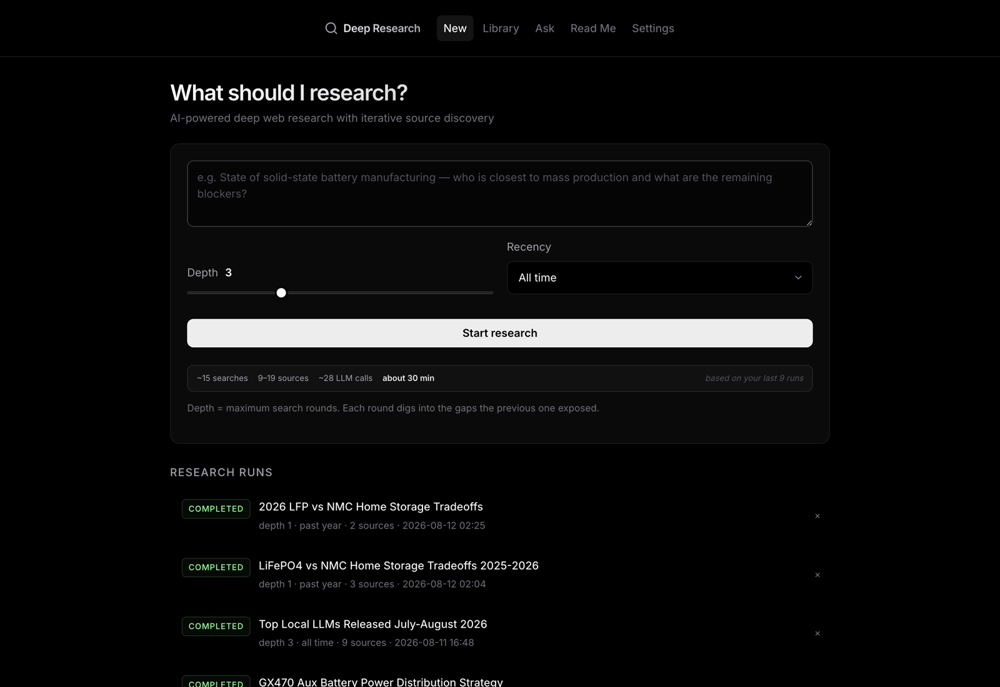
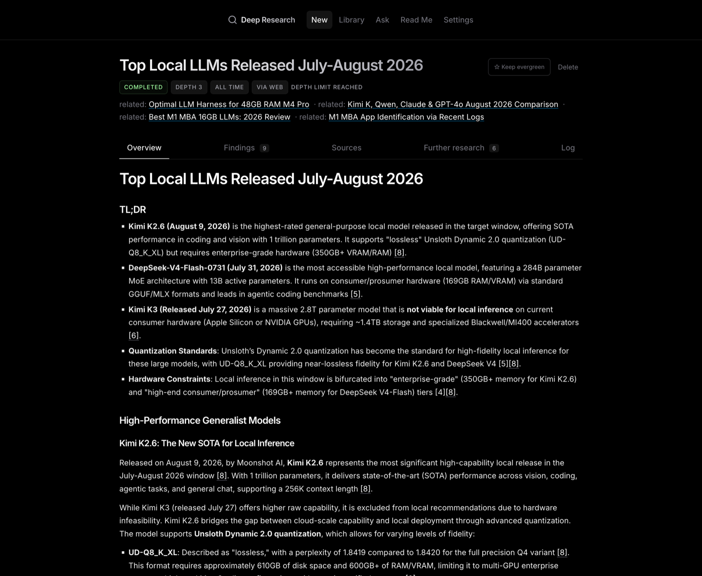
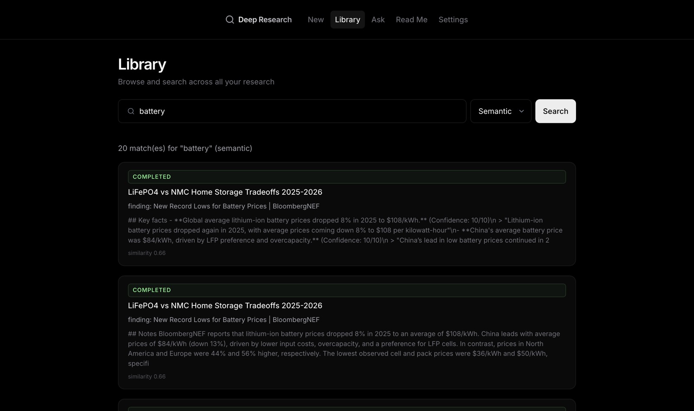
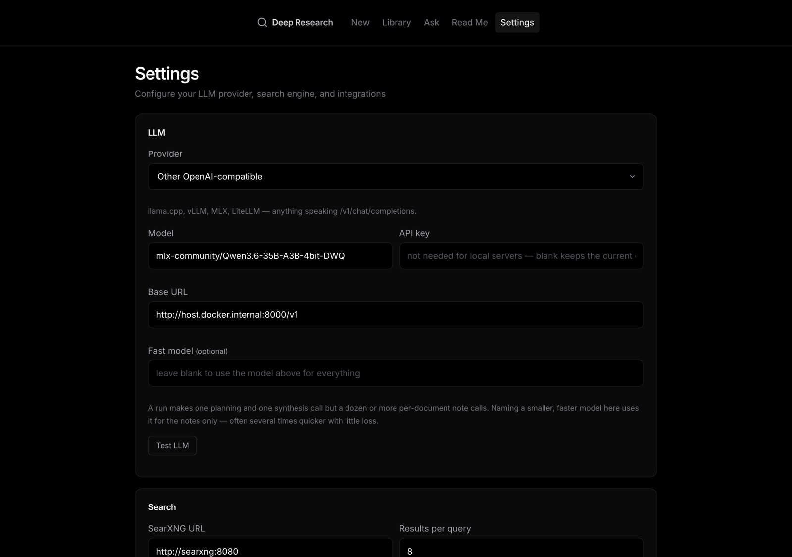

# 🔭 Deep Research

[](https://github.com/lukeswade/deep-research/actions/workflows/ci.yml)
[](LICENSE)
[](https://www.python.org/)
[](#install)

A self-hosted deep-research agent — a personal Perplexity that digs much
deeper. Give it a question, a depth, and a recency window; it unpacks the
question into targeted web searches, reads the results, writes per-source
notes with verbatim evidence, lets the gaps steer further search rounds, and
ends with a cited overview plus follow-up suggestions.

Everything runs on your own machine. The only thing that can leave it is the
LLM call — and even that stays local if you point it at llama.cpp, LM Studio,
Ollama, or MLX.

- **Web UI** with live streaming progress, pre-flight run estimates
  calibrated to your own hardware (cache-hit-aware cost estimates for cloud
  models), a research library (keyword + semantic search), and an "Ask" page
  that answers from everything you've researched, with citations.
- **A 0–10 depth dial** from instant AI answers (one search, a cited
  snippet-grounded summary) up to deep-research runs budgeted for dozens of
  sources, with a fast-model triage pass so doomed candidates cost seconds,
  not full analyses.
- **Citation chasing**: sources that make the cut get their best references
  fetched too — datasheets and primary documents search engines never surface.
- **Reads the hard parts of the web**: YouTube videos via their caption
  transcripts, Reddit threads (post + comments) via the JSON API, and scraped
  SEO clones collapsed into a single source. Fetches refused by CDN bot walls
  are retried with a real Chrome TLS fingerprint, and an optional headless
  browser sidecar solves JavaScript challenges.
- **Evergreen topics** re-research themselves daily, and every refresh leads
  with *what's new* instead of repeating itself.
- **One-click exports** of the whole research record: PDF, a self-contained
  web page, or a portable one-file mini-app with tabs, search, and clickable
  citations. Plus a **Telegram bot** for starting runs and receiving results
  on your phone.
- **Multi-user aware**: runs are tagged with the Cloudflare Access identity
  (or LAN label) that started them.
- **Everything is plain markdown on disk** (`data/research_data/<run>/`).
  SQLite and the vector index are derived — `reindex` rebuilds them from the
  files at any time.




## What it looks like

A finished run: a cited synthesis, the sources behind every claim, per-source
findings with verbatim evidence, suggested follow-ups, and the full log.



Semantic search across everything you have ever researched — the library
answers by meaning, not just keywords.



Bring your own model. Any OpenAI-compatible endpoint works, and the
high-volume note-taking calls can go to a smaller, faster model than the one
doing the planning and synthesis.



---

## Install

You need Docker (with the compose plugin) and an LLM. Nothing else.

```bash
git clone https://github.com/lukeswade/deep-research.git
cd deep-research

cp .env.example .env
nano .env                 # add an LLM (see below) + a SEARXNG_SECRET

mkdir -p data && sudo chown -R 1000:1000 data   # container runs as uid 1000

docker compose build      # build natively on this machine, don't cross-build
docker compose up -d
```

Open <http://localhost:8090>. First run pulls the SearXNG image and bakes a
small embedding model into the app image, so the initial build takes a few
minutes and produces a ~2.5 GB image.

### Choose an LLM

Deep Research talks to any **OpenAI-compatible** endpoint. Pick a preset on the
Settings page and the base URL is filled in for you:

| | Providers |
|---|---|
| **Cloud** | DeepSeek · OpenAI · OpenRouter · Groq · Together |
| **Local** | LM Studio · Ollama · llama.cpp / vLLM / MLX (as "Other") |

The quickest cloud start is DeepSeek — cheap, and strong at structured output:

```
DEEPSEEK_API_KEY=sk-...
```

The quickest local start is LM Studio or Ollama:

```
LLM_PROVIDER=ollama
LLM_MODEL=qwen2.5:32b-instruct
LLM_CONCURRENCY=1        # one request at a time suits a single GPU
```

Two things worth knowing when running locally:

- **Prefer a model that supports strict `json_schema` output** (LM Studio and
  recent llama.cpp do). The pipeline uses schema-constrained decoding, which
  makes malformed JSON impossible. Without it everything still works, but a
  weaker model will occasionally emit unparseable output and lose that source.
  A 30B-class instruct model is a good floor for research quality.
- **Set a fast model.** A run makes one planning call and one synthesis call
  but a dozen or more per-document note calls, so nearly all the time goes into
  note-taking. Naming a smaller model in the *Fast model* box uses it for the
  notes, the per-round candidate triage, and the first-look screening that
  spares full reads for junk pages, leaving the big model to do the thinking:

  ```
  LLM_MODEL=qwen2.5:32b-instruct   # planning + synthesis
  FAST_MODEL=qwen2.5:7b-instruct   # per-source notes
  ```

You can change all of this later on the **Settings** page, which also has
"Test LLM" and "Test SearXNG" buttons. Settings live in `data/settings.json`
(chmod 600) and override `.env`.

---

## Using it

**Depth** is a 0–10 effort dial. Every two steps buy roughly one full search
round with its budgets, so odd numbers are genuine half-steps — twice the
granularity in the range where most runs live. Each round runs several
targeted queries, triages and reads what's useful, and a gap analysis decides
what to search next. Runs stop early when the topic is saturated (at depth 7+
that takes two saturated verdicts in a row), after two rounds that find
nothing new, or at per-depth source and LLM-call caps.

- **Depth 0** is an instant answer — one search and a concise, cited summary
  grounded on the result snippets, like a search engine's AI overview. No
  pages are fetched; it's the fastest grounded answer the tool can give.
- **Depth 1–4** is a question: one to two rounds, source budgets of ~8–28.
  The form defaults to depth 3.
- **Depth 5–7** is a deep dive: two to four rounds, budgets up to ~54 sources.
- **Depth 8–10** is deep-research territory: budgets up to ~85 sources at
  depth 10. On a local model that's an hour or more unless you raise
  `LLM_CONCURRENCY` (batching servers like oMLX and llama.cpp run parallel
  note-taking at nearly linear aggregate throughput) or point the
  planning/synthesis at a cloud model.

The new-run form shows a live estimate — searches, sources, LLM calls, time,
cost — for the depth you've dialed in, calibrated against your own completed
runs, and warns you if something similar is already in your library.

**Search categories** — the checkboxes under the form pick which SearXNG
categories a run queries: general, science, it, news, **videos** (searched on
YouTube and read via caption transcripts), **social media** (reddit threads,
read through the JSON API — note reddit rate-limits anonymous search hard,
so this category can come back empty for a while after heavy use), and
files. The default is the instance's
`SEARCH_CATEGORIES`; your last selection is remembered in the browser, and
retries and evergreen refreshes inherit the run's categories.

**Recency** maps to search-engine time filters plus a date check on the
documents themselves. Engine date metadata is imperfect, so undated sources
are kept but flagged, and the synthesis is told to prefer dated in-window
material. Treat the windows as best effort.

Every run directory contains `overview.md` (the cited synthesis),
`further-research.md`, `sources.md`, per-source `findings/*.md`, a `rounds/`
log, `meta.json`, and `events.jsonl`. In the UI, a finished run has four tabs
— Overview (with the bibliography its `[n]` citations jump to), Sources (each
source's notes, expandable), Further research (one-click follow-up runs), and
Log — plus three one-click exports of the entire research record:
**Export PDF** (a print-ready document), **Export HTML** (one
self-contained page with
collapsible notes, dark-mode aware, zero external assets — opens from a
double-click and shares over anything), and **Export interactive** (the same
single file as a portable mini-app: Overview/Sources/Notes/Log tabs,
client-side search across sources and notes, citations that jump to the
bibliography, a theme toggle, and a print layout). **Re-synthesize** rewrites the overview from the run's
stored sources without re-searching anything — for when the research
succeeded but the final synthesis call didn't (a truncation, or a
thinking-mode model emitting its reasoning instead of the document; normal
runs also detect that and retry once automatically).

**Triage before reading.** Search returns far more candidates than are worth
reading. A fast-model pass over titles, URLs and snippets drops the obvious
junk — product listings, wrong-model pages, content farms — before anything
is fetched, so the expensive full-document analysis runs only on plausible
sources. Those that survive are read whole: the note-taker sees the entire
extracted page (up to ~13k tokens), not a keyword snippet.

**Authority sites.** Some of the best primary sources — like charm.li, the
mirror of full factory service manuals for nearly every car — are barely
indexed by search engines and never surface on their own. The Settings page
keeps a short curated list ("domain — what it holds"); when a topic fits one,
the planner dedicates a `site:`-scoped query to it. Add your own goldmines as
you find them.

**Citation chasing.** When a source makes the cut, its most relevant outbound
references become candidates in the same run — the links a good page chooses
are often better than anything a search engine returns, and unreachable
through one. Chased findings show their provenance ("cited by [3]"). Turn it
off in Settings if you want engine results only.

**Video, Reddit, and the spammy web.** YouTube results are read through their
caption transcript (authored or auto-generated) — for how-to topics that's
where the actual step-by-step knowledge lives. Reddit threads are read through
Reddit's public JSON API, post and comment tree included, instead of the
unscrapeable JavaScript shell reddit.com serves. And when the same article
shows up under several domains — scraped SEO clones, syndicated copies — the
duplicates are collapsed to a single source instead of being analyzed and
cited repeatedly.

**Bot walls.** When a page answers with a bot-wall status (403, 429, a
challenge interstitial), the fetch escalates: first a retry presenting a real
Chrome TLS fingerprint — most CDN blocks key on the TLS handshake, and this
recovers sites like Britannica or Merriam-Webster without running a browser —
and then, if you've opted in, a [FlareSolverr](https://github.com/FlareSolverr/FlareSolverr)
sidecar that drives a real headless browser through JavaScript challenges:

```bash
docker compose --profile browser up -d
```

then set `BROWSER_SOLVER_URL=http://flaresolverr:8191` in `.env` (add
`COMPOSE_PROFILES=browser` there too so plain `docker compose up -d` keeps
managing it) or paste the URL in Settings. Some walls (Yelp, PerimeterX
sites) defeat even that — those fail with an honest reason in the log.

**Ask** answers questions from everything you've researched so far, citing the
runs it drew on — and every answer offers a one-click "Research this deeper"
handoff into a full run. New runs automatically build on related earlier
research, and as you type a query the form points out if something similar is
already in your library.

**Evergreen** — the ☆ button on a finished run. The topic is re-researched
once a day against a recent window, and each refresh appears as a linked child
run whose overview leads with **"What's new since the last look"** — the same
delta treatment applies to any follow-up or retry, so you read the changes,
not a rerun of what you already know. Toggle it off with the same button.

### Telegram (optional)

1. Message **@BotFather** → `/newbot` → put the token in `.env` as
   `TELEGRAM_BOT_TOKEN`.
2. `docker compose restart app`, message your bot `/id`, put the number in
   `TELEGRAM_ALLOWED_USER_IDS`, restart again.
3. Send it a question. It walks you through depth and recency, then delivers
   the overview when the run finishes. `/help` lists every command.

The bot only answers allowlisted user IDs. Without a token the app simply runs
web-only.

### CLI

```bash
docker compose exec app python -m app.cli run "your question" --depth 3 --recency month
docker compose exec app python -m app.cli runs
docker compose exec app python -m app.cli ask "question over everything so far"
docker compose exec app python -m app.cli reindex    # rebuild indexes from the .md files
```

---

## Remote access (optional)

The app binds to port 8090 with no TLS and, by default, no password. That is
fine on your own machine and **not** fine on the open internet.

If you want it reachable from your phone, the intended path is a Cloudflare
Tunnel plus a Cloudflare Access policy — no inbound ports, TLS handled for
you, and an identity check before any request reaches the app:

```bash
# after creating a tunnel in the Cloudflare dashboard and adding an Access policy
echo 'CLOUDFLARE_TUNNEL_TOKEN=...' >> .env
docker compose --profile tunnel up -d
```

Set `WEB_PASSWORD` as well. Access is the lock on the door; the app password is
the lock on the room, and it's what protects you if a tunnel ever points at a
hostname whose policy you forgot to attach.

Runs are attributed to whoever started them: tunneled requests are tagged with
the signed-in Cloudflare Access identity, local ones with `LAN_USER_LABEL`,
and Telegram runs with the sender's name — so a shared instance shows who
researched what.

---

## Development

```bash
./scripts/dev.sh     # hot-reload stack; SearXNG exposed on 127.0.0.1:8081
./scripts/test.sh    # full test suite in the dev image
./scripts/check.sh   # what CI runs — tests plus a startup self-check
```

Build natively on each architecture (arm64 Mac for dev, amd64 server for
prod). Don't cross-build with QEMU: the torch stack is slow and flaky under
emulation. On the server, `git pull && docker compose build && docker compose up -d`.

The dev and prod images are tagged separately (`mkw-app-dev` / `mkw-app`), so
building one never clobbers the other.

---

## Operations

- **Backup**: `tar czf backup.tgz data/` — that is the entire state (settings,
  SQLite, vectors, and all the research markdown).
- **Rebuild indexes**: `docker compose exec app python -m app.cli reindex`
  reconstructs the database, keyword search, and vectors from the markdown on
  disk. The markdown is the source of truth.
- **Deleting a run** removes it everywhere: database row, keyword index,
  vectors, and the run directory. It cancels the run first if it is still
  going. This is not recoverable — the markdown goes with it, so take a backup
  if you might want it later.
- **Interrupted runs** (a restart mid-run) keep everything already gathered and
  offer *Retry with same parameters*. Queued runs survive restarts.
- **Logs**: `docker compose logs -f app`, plus a rotating `data/app.log`.
- **One process, one worker.** The job queue, SSE bus, and run registry live in
  memory in a single process. Never add `--workers` to uvicorn, and run only
  one app container per data directory — a second one would also fight for the
  Telegram token and you'd see 409 Conflict in the logs.
- **Don't open `data/app.sqlite3` with a host `sqlite3` while the app is
  running.** WAL mode over a bind mount leaves stale `-shm`/`-wal` sidecars
  that break the container with "disk I/O error". Use
  `docker compose exec app python -m app.cli runs` instead. If it happens: stop
  the app, delete `data/app.sqlite3-shm` and `-wal`, start again.
- **Search engines rate-limit.** Google, Brave, DuckDuckGo and Startpage all
  throttle or serve CAPTCHAs to home and datacenter IPs under research-volume
  traffic, and the stock SearXNG `general` category is made up of exactly those.
  The app therefore searches `general,science` by default, which also reaches
  Crossref, OpenAlex, Semantic Scholar and arXiv — research-grade sources that
  don't gate. General-web results lead and academic ones backfill, so a
  practical question isn't answered out of a journal. Queries are throttled to
  two at a time for the same reason. If every engine does block, a run says so
  explicitly rather than reporting "no sources found"; wait a few minutes and
  hit *Retry*. Tune with `SEARCH_CATEGORIES`, `SEARCH_CONCURRENCY`, and
  `BLOCKED_DOMAINS` for sites you never want fetched.

---

## Security notes

- Secrets live in `.env` (never committed) and `data/settings.json` (mode 600).
  Neither is baked into the image.
- Fetched pages are rendered with raw HTML disabled everywhere, and search
  snippets are escaped before highlighting — page content can't inject markup
  into your UI. Fetched text is framed as untrusted data in every prompt.
- The fetcher refuses private, loopback, and link-local addresses (set
  `ALLOW_PRIVATE_FETCH=true` if you genuinely need intranet sources) and
  rate-limits itself to one request per second per domain (slower on hosts
  with strict limits, like reddit). It sends a standard
  browser user agent by default because many CDNs reject unknown clients with
  403 (set `USER_AGENT` to identify yourself instead), and retries bot-wall
  refusals once with a real Chrome TLS fingerprint
  (`BROWSER_IMPERSONATION=false` to disable). robots.txt is **not** honoured by
  default — this reads the same handful of pages you would open by hand
  rather than crawling a site. Set `RESPECT_ROBOTS=true` to enforce it.
- Run files are served through a filename allowlist plus a containment check,
  so a run id can't be used to read outside its own directory.

## Licence

MIT — see [LICENSE](LICENSE).
